# Smart Energy Monitoring with the Arduino Ecosystem

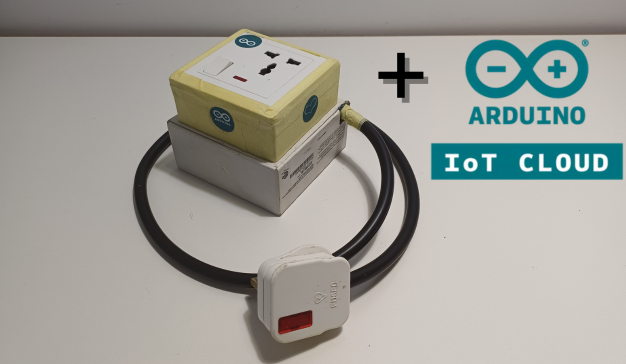

In this age where even refrigerators think they’re smart, the **Smart Energy Monitoring with the Arduino Ecosystem** project takes a step towards making household appliances not just think, but actually be smart—about energy consumption and efficiency, at least.

At the heart of this project is the **ESP32 Development Board**, coupled with the **PZEM-004T AC Energy Monitor**, to track how much electrical energy devices like your refrigerator, laptop, or even your washing machine are really consuming. As these appliances age, they become more power-hungry and their energy consumption habits deviate from the original specifications or performance benchmarks set by the manufacturers. And it becomes necessary to monitor their consumption over time.

The system uploads data on **voltage**, **current**, **active power demand**, **energy consumption**, and **AC supply frequency** to the **Arduino IoT Cloud**. This means you can catch your refrigerator red-handed if it’s using more power than expected, all from the screen of your smartphone.

The intention behind this project goes beyond just creating awareness on energy, but also demonstrating a practical application of IoT technology in everyday life. By integrating such intelligent systems into homes, we can transform energy management and efficiency—turning every home into a center for energy consciousness.

> [!WARNING]
> 
> Working with AC power can be hazardous and, in extreme cases, lethal. It involves handling live wires and high voltages that pose serious risks of electric shock or burns.
> 
> If you are considering replicating this project, it is crucial to have a solid understanding of electrical safety principles and to always follow best practices. Ensure that all connections are secure, and never work on live circuits. If in doubt, seek assistance from a qualified electrician. Your safety is paramount; never compromise on precautionary measures while dealing with electrical systems.
> 
> Thank you for understanding.

## 1. Overview of AC Power and Its Measurement

It's important that I set the stage by giving a brief overview of the quantity that this project will be dealing with—AC power. 
Alternating Current (AC) Power is a type of electrical power delivered to homes, businesses, and industries. It alternates its direction of flow at a regular interval, typically depicted as a sine wave. This section explains critical AC quantities such as voltage, current, power, and frequency.

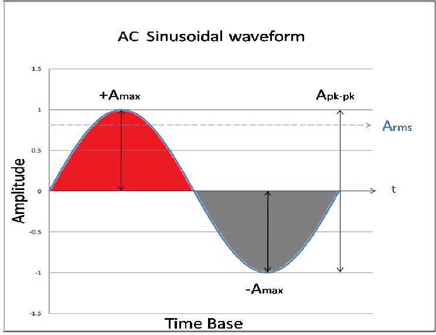

### AC Power Quantities

#### 1. Voltage (V)
Voltage is the force or pressure from an electrical circuit's power source that pushes charged electrons through a conductor, enabling them to do work such as lighting up a bulb. Its amplitude varies sinusoidally with time.  Household appliances typically operate around standard voltages depending on regional electrical standards (e.g., 120V in the USA, 230V in Europe, Africa, and other parts of the world). Its unit of measurement is volts(V).

In practice, the actual RMS voltage supplied can deviate slightly from standard values due to factors such as grid demand fluctuations and distance from supply. So while the nominal voltage is set at 120V or 230V, the actual voltage experienced by appliances may vary slightly, though it generally stays within a close range of these standards.

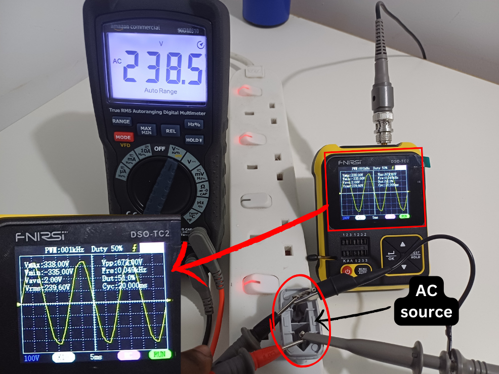

#### 2. Current (I)
Current, measured in amperes (A), is the rate at which charged electrons flow through the conductor. In AC systems, the current also varies sinusoidally, in phase or out of phase with the voltage.

#### 3. Power (P)
Power is the rate at which energy is transferred by an electric circuit per unit time. It is an important parameter specified by manufacturers to give users an idea of how much energy an appliance can consume, and in other cases, how powerful it is at doing work compared to similar appliances used for the same type of work.

The two types of power are active power (P) and reactive power (Q), but this project deals with only active power. Active power is measured in watts (W).

#### 4. Energy (E)
Energy is the total power consumed over time. For electrical systems, it is typically measured in kilowatt-hours (kWh). The energy used can be calculated by integrating the power over time. Integration essentially means summing but in a continuous rather than a discrete way.

#### 5. Frequency (f)
Frequency, expressed in hertz (Hz), is the number of cycles the AC waveform undergoes per second. Standard frequencies vary by country (e.g., 60 Hz in the USA and 50 Hz in Europe, Africa, and other parts of the world)

## 2. Components and Parts
#### 1. ESP32 Development Board
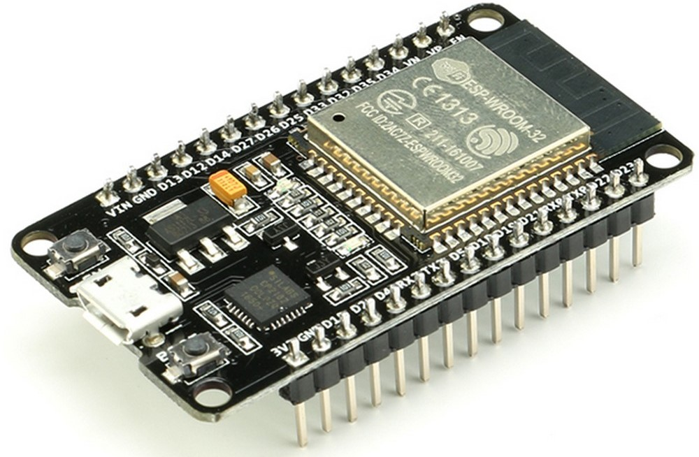

The ESP32 serves as the central processing unit of the system, handling data acquisition from the PZEM-004T AC Energy Monitor and transmitting it to the Arduino IoT Cloud. It includes a Wi-Fi-capable chip, allowing it to connect to the internet directly. While the board accepts a 5V DC input, it primarily operates at 3.3V thanks to its integrated 5V to 3.3V voltage regulator.

**Note**: I planned to use an Arduino Nano RP2040 Connect as the microcontroller. Unfortunately, I broke off its antenna while handling it. Attempts to solder it back in place failed due to its Surface Mount Technology (SMT) which requires soldering with a reflow oven.

Consequently, I switched to the ESP32 development board, which, while not originally intended, proved to be a suitable alternative.  Although this change slightly deviates from my project's original title which focuses on the Arduino ecosystem, I maintained the project title since the code, written in the Arduino Cloud editor, remains compatible with minor adjustments for the RP2040 Connect.

#### 2. PZEM-004T AC Energy Monitor with 100A Current Transformer
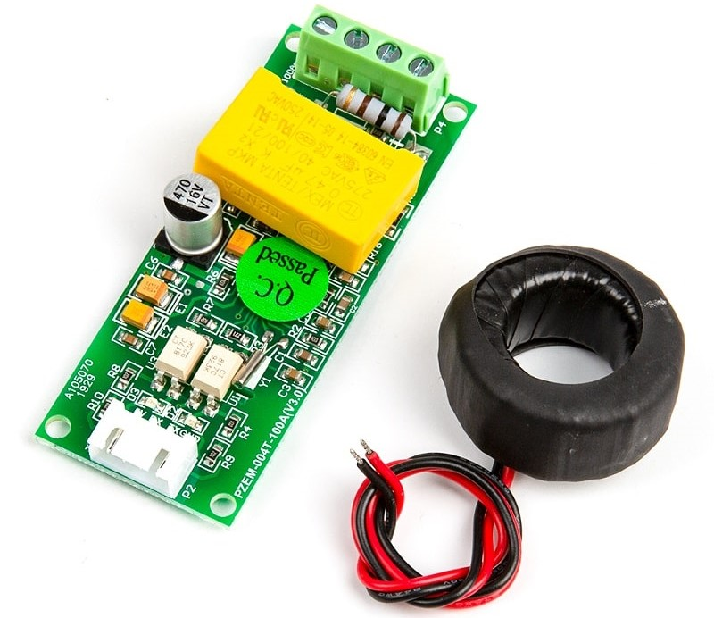

The PZEM-004T AC Energy Monitor acts as the interface between the AC power quantities and the DC measurement circuit. It accurately measures electrical parameters such as voltage (up to 260V), current (up to 100A), power, energy, frequency, and power factor, using a non-invasive approach. The measured data is then relayed to the ESP32 board through a serial connection. This monitor is versatile, operating on either 5V or 3.3V DC.

#### 3. 5V Switched Mode Power Supply (SMPS)
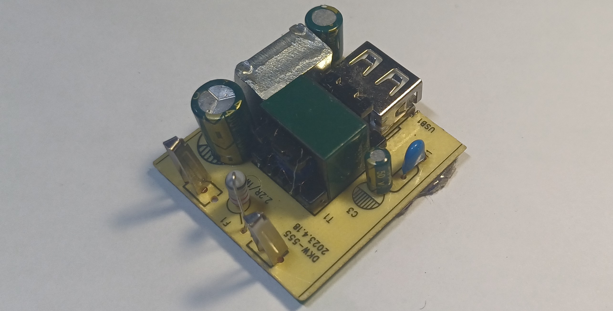

This switched-mode power supply, repurposed from a phone charger I had lying around, is the primary power source for the system. It efficiently converts 100-240V AC mains power to a stable 5V DC output, delivering up to 2.4A. The power adapter connects to the ESP32 board via USB, providing the necessary 5V DC. The PZEM-004T AC Energy Monitor then receives a regulated 3.3V DC from the ESP32.

I opted to use this ready-made SMPS because it is compact, more efficient, and generates less heat compared to a custom-built linear power supply, which would also have been challenging due to the unavailability of components in my region.

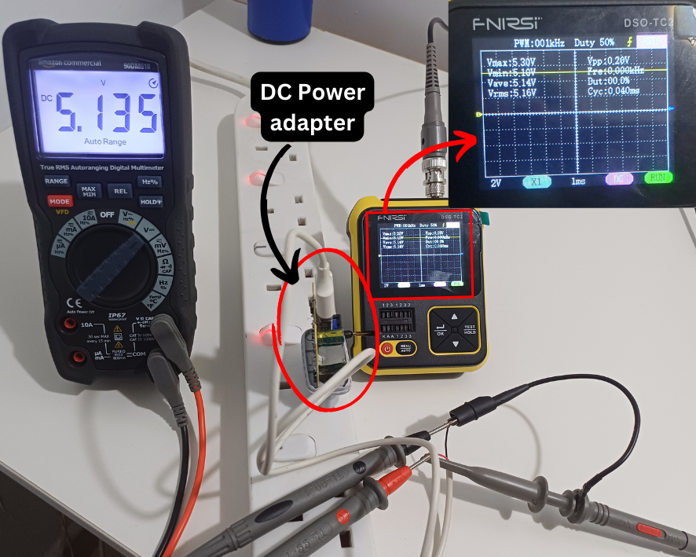

#### 4. Other Components and Tools
In addition to the main components, the setup includes:
 - Jumper wires
 - Breadboard
 - AC power plug
 - AC power socket and electrical box
 - Thick 3-wire AC power chord
 - Recycled enclosure box

The following tools were used for assembly and testing:
 - Digital multimeter
 - Portable digital oscilloscope
 - Hot glue gun
 - Screwdriver set

## 3. Components Preparation and Assembly

With my components and tools ready on the workbench, I was ready to start assembling and programming.

#### 1. AC Power Chord and Socket Connection
I connected the live, neutral, and earth wires of the thick 3-wire AC power chord to the respective terminals of the AC power plug. They would supply AC power to both the energy monitoring system and the load to be monitored.

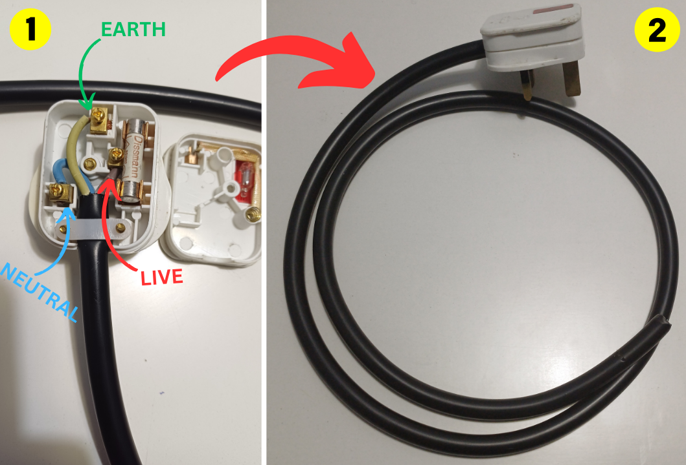

#### 2. Energy Monitoring Module Wires
I went on to prepare the jumper wires for the connection between the ESP32 board and the energy monitoring module. I used 4 wires (Vcc, Rx, Tx, and Gnd). I made some modifications to the wires so that they could easily connect to the module and the module could fit in the enclosure box.

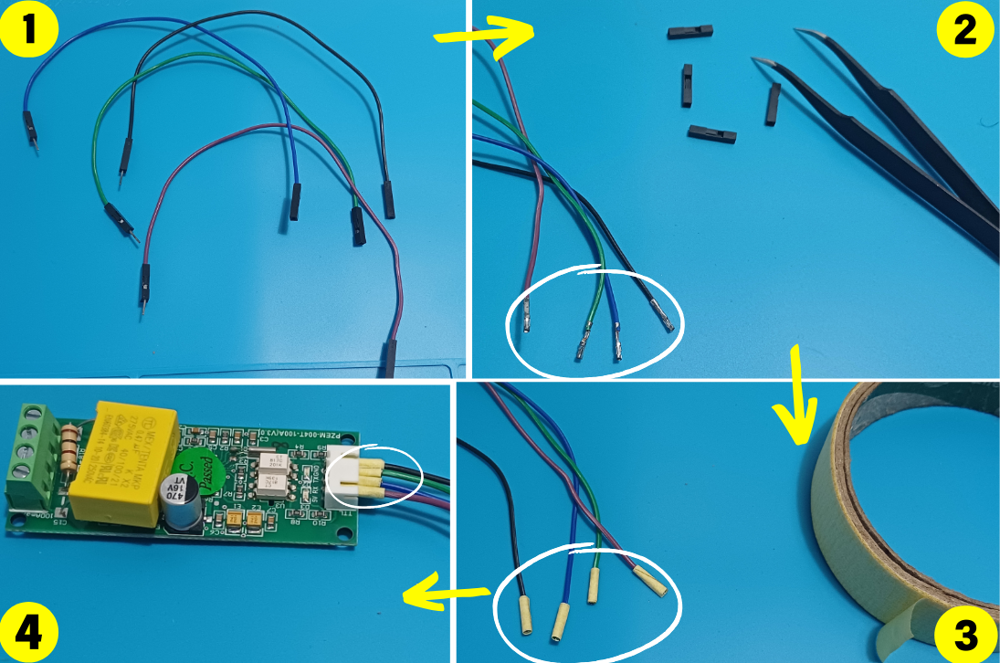

#### 3. Components Enclosure Box and Placement Plan
Coming up with an enclosure for the system was a tough one. I didn’t have access to a 3D printer, so designing one was not an option. After a few iterations, I settled on recycling an old Apple AirPods packaging box I owned.

I got the box and drew the placement plan for the DC power supply adapter, the energy monitoring module, the microcontroller, and the incoming and outgoing AC power wires.  I also cut holes in the box for the incoming and outgoing AC power wires.

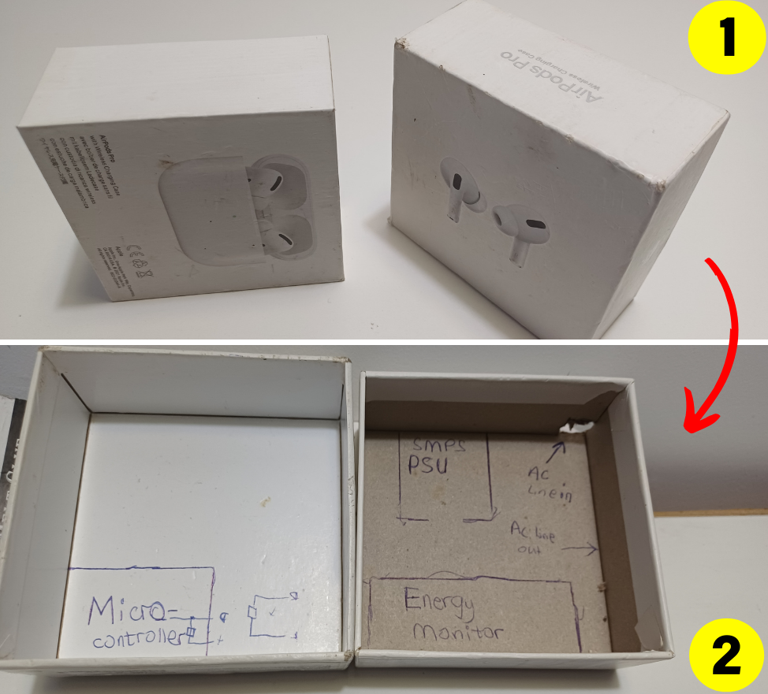

#### 4. Internal connections
For the internal connections, I connected the AC power wires through the PZEM-004T energy monitor to the DC power adapter in parallel with the AC outgoing wires. Here is a drawn diagram to help visualize the AC power connections.

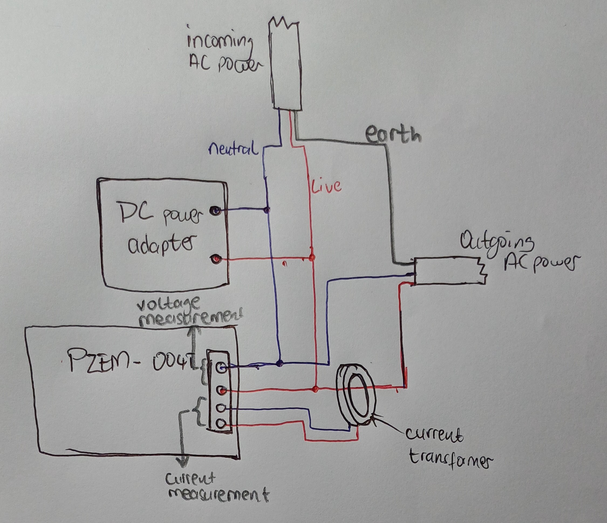

  

  
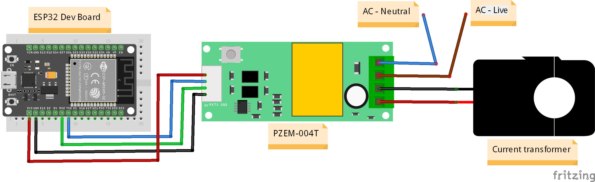

  
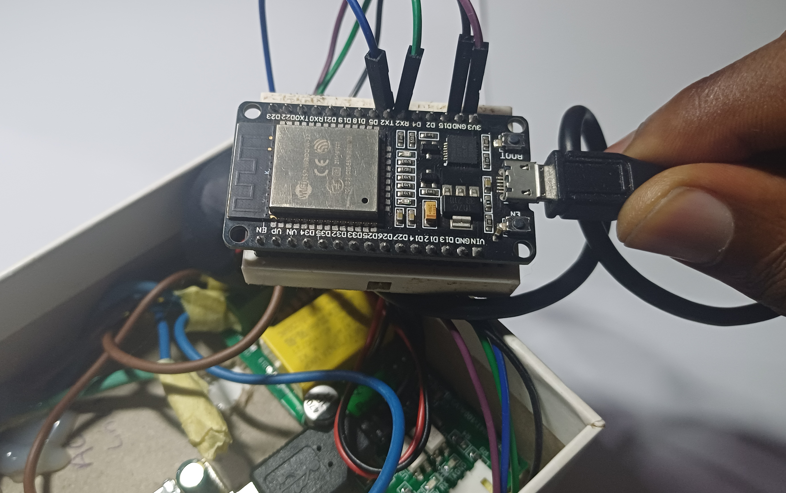

#### 5. Gluing
I applied some glue to the internal and external components to keep them in place. I also glued the incoming ac power chord to prevent it from moving around and potentially disconnecting from the energy monitoring module.

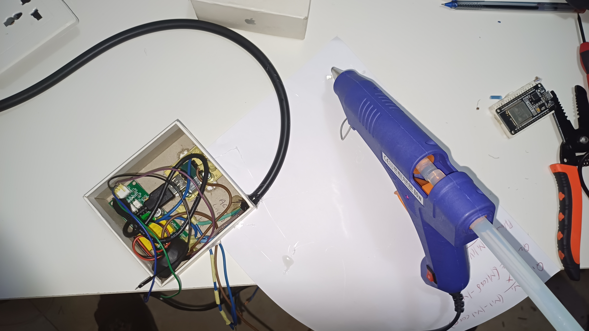

  

#### 6. External Connections
With the internal connections done, I went on to the external connections. I just needed to connect the live, neutral, and earth wires of the outgoing AC power wires to their respective slots on the socket. I then closed the electrical box with the socket, and that concluded the assembly.

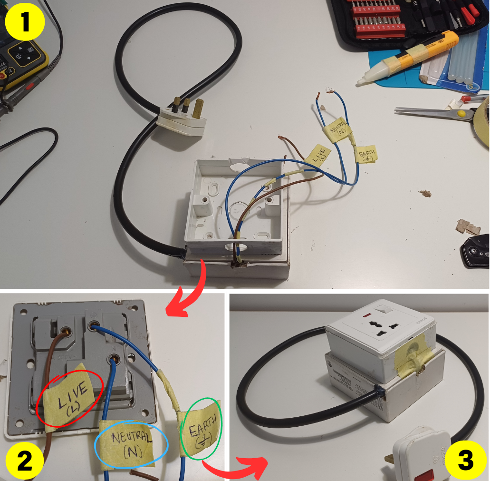

#### 8. Aesthetics
I went a step further to add some beauty to the project with some masking tape and Arduino stickers that came with the Arduino RP2040 Connect.

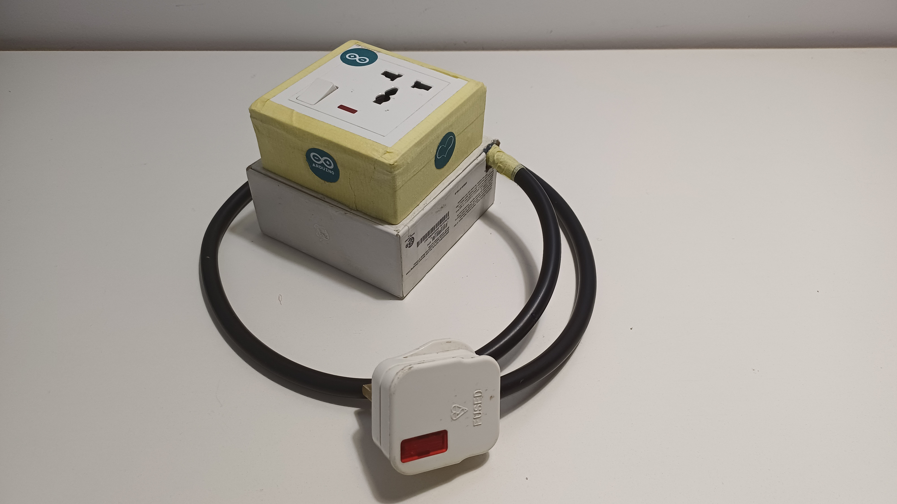

## 4. Testing
I conducted 3 tests with the system, featuring different loads with different power requirements. They were:
 - A 1500-watt kettle
 - A 20-watt phone charger
 - A variable wattage water dispenser

The variable wattage of the dispenser arises because, at any time, the heating system, the cooling system, or both are either operating or not.

Here are the videos in which the tests were conducted:

#### Test 1: 1500W Kettle & 20W Phone Charger

https://youtube.com/watch?v=ckypnygF4A8
  

#### Test 2: Variable Wattage Water Dispenser

https://www.youtube.com/watch?v=FGi1NHuwpNw

## 5. Results and Analysis
From the test conducted in the video, we can conclude that the system works very well with appliances, from small inefficient chargers to power-hungry heating kettles.

## 6. Conclusion and Remarks
As already mention in the Abstract, this project contributes to the energy efficiency and management of household appliances. But its application goes beyond just the household and simply monitoring appliances.  With recent advancements in machine learning and artificial intelligence, the data collected from such smart meters can be used to predict energy consumption patterns, optimize energy usage, and even automate the operation of appliances.

This project is just a stepping stone towards a future where every home is a smart home, and every appliance is a smart appliance with the Arduino ecosystem as the glue that binds them all together.

This project find itself useful in homes, offices, and even industries for monitoring the energy consumption of appliances and heavy machinery.
It is also useful to researchers who would need a way to collect data on the energy consumption of appliances.
Lastly, it's a great inspiration to fellow makers and hobbyists.

## 7. Resources and References
### Datasheets
 * [ESP32 datasheet](https://www.espressif.com/sites/default/files/documentation/esp32_datasheet_en.pdf)
 * [PZEM-004T datasheet & manual](https://innovatorsguru.com/wp-content/uploads/2019/06/PZEM-004T-V3.0-Datasheet-User-Manual.pdf)

### Documentations
 * [PZEM004Tv30 library documentation](https://github.com/mandulaj/PZEM-004T-v30)
 * [Arduino IoT Cloud documentation](https://docs.arduino.cc/arduino-cloud/)

### Project Assets
 * [Arduino Sketch/Code](https://app.arduino.cc/sketches/c1ae3b11-8a50-4f1b-909e-8092d69db51b?view-mode=preview)
